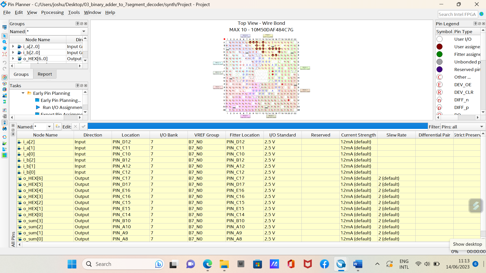

# Seven Segment Display using FPGA and Verilog HDL
A seven-segment that displays a representation of numbers entered by the user’s input have been design and tested. Functional validations of the buttons input resulting to the display of numbers (1, 2, etc) were also tested. Each display consists of seven segments of liquid crystals on the MAX 10 board. These segments have two states: on and off. 

I used four switches on the MAX10 board, all four switches together represent a four bit binary number which with a combination will result to represent a number. It has switch SW3 represents the most significant bit and the switch SW0 represents the least significant bit. 

# Corresponding switches and results
**0000 = 0** : displays 0 when all four switches are zero.  
**0001 = 1** : displays 1 when sw3, sw2 and sw1 set to 0 , and sw0 set to 1.  
**0010 = 2** : displays 2 when sw3, sw2 and sw0 set to 0 , and sw1 set to 1.  
**0011 = 3** : displays 3 when sw3 and sw2 set to 0 while and sw1 and sw0 set to 1.  
**0100 = 4** : displays 4 when sw3, sw1 and sw0 set to 0 , while sw2 set to 1.  
**0101 = 5** : displays 5 when sw3, sw1 set to 0 while and sw2 and sw0 set to 1.  

****Video recording of the project is also attached****

# Things needed 
1. ****MAX10 D10 Lite FPGA board****
2. ****Quartus Prime****
3. ****USB Cable****
4. ****Seven Segment Display****: This comes with the MAX 10 board chosen for this project.

# Steps in implementing the design
1. Design and write the verilog code
2. Pin Assignement using the Pin planner in Quartus Prime Software
3. Programme the MAX 10 Board using the programmer in Quartus Prime Software

# 

